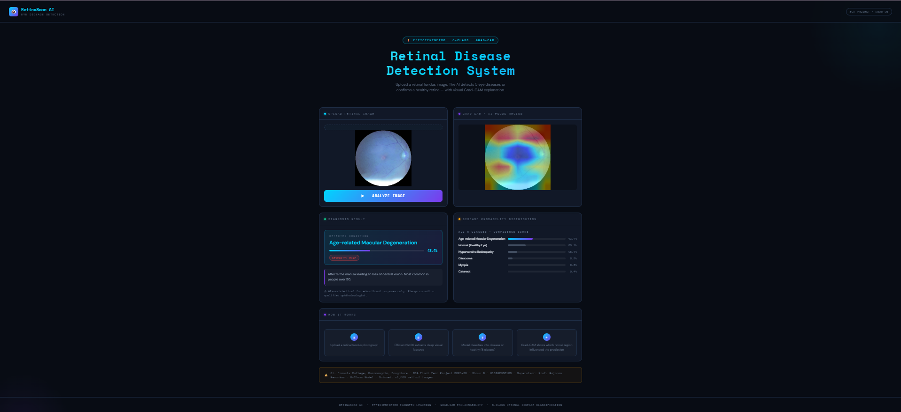
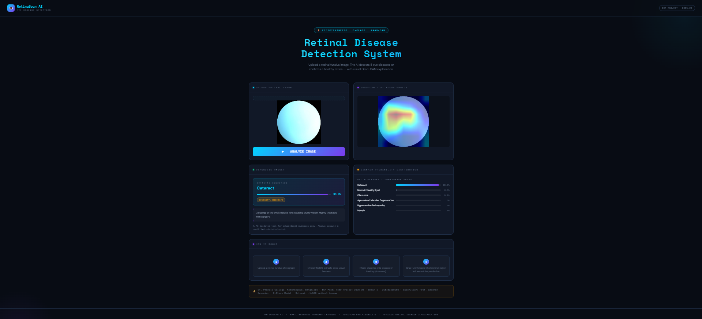
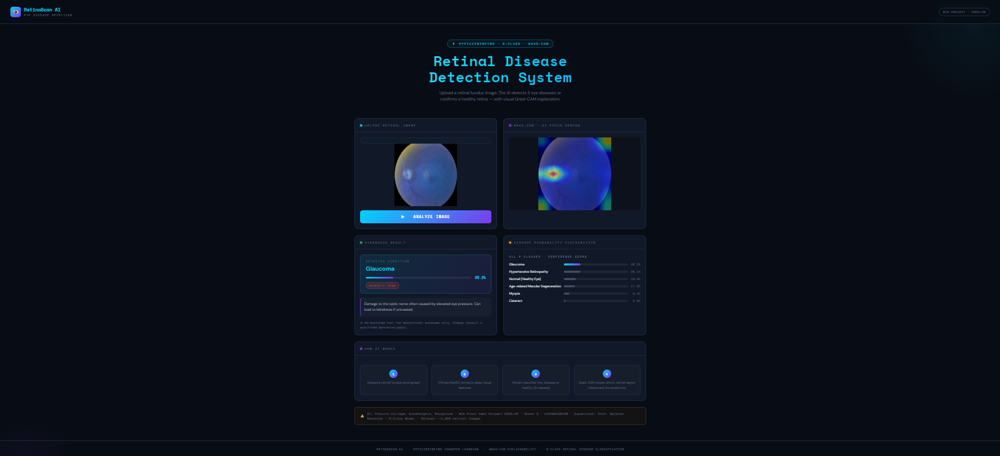

# RetinaScan-AI 👁️

An AI-powered web application for automated eye disease detection from retinal fundus images, built as a final year BCA project.


---

## Overview

RetinaScan-AI uses a fine-tuned deep learning model to classify retinal fundus images into six categories, providing an instant, browser-based diagnostic aid with visual explainability via Grad-CAM heatmaps.

**Detected classes:**
- Age-related Macular Degeneration (`ageDegeneration`)
- Cataract (`cataract`)
- Glaucoma (`glaucoma`)
- Hypertensive Retinopathy (`hypertension`)
- Myopia (`myopia`)
- Normal / Healthy Eye (`normal`)

---

## Model

- **Architecture:** EfficientNetB0 (transfer learning)
- **Training:** Two-phase fine-tuning strategy on retinal fundus image dataset
- **Output:** 6-class classifier (expanded from an initial 5-class version to add a "normal/healthy" category)
- **Explainability:** Grad-CAM heatmaps generated from the `top_conv` layer, highlighting the regions of the image the model focused on for its prediction
- **Saved model file:** `best_eye_model_v2.keras`
- **Training environment:** Google Colab (retraining script included in the repo)

A standalone **Gradio app** is also included for quick local testing/demoing of the model with Grad-CAM visualization, separate from the production Flask web app.

---

## Web Application (Backend)

The production-facing app is a **Flask** backend serving a custom HTML/CSS/JS frontend with:
- Drag-and-drop image upload
- Animated probability bars for each class
- Dark medical-themed UI
- Inline Grad-CAM heatmap display

**Backend stack:**
- Flask (application logic, routing, inference)
- Gunicorn (production WSGI server, replacing Flask's built-in dev server)
- Conda environment: `retinascan`

---

## Deployment Architecture

The app was deployed on an **AWS EC2** instance, with a CI/CD pipeline for continuous deployment.

> **Note:** The AWS resources were terminated after the assignment to stay within the Free Tier, so there is no live URL. The deploy workflow is now manual (`workflow_dispatch`). Evidence of the working deployment is in [`docs/screenshots/`](docs/screenshots/).

```
GitHub (main branch)
      │  git push
      ▼
GitHub Actions (deploy.yml)
      │  SSH (appleboy/ssh-action)
      ▼
EC2 Instance (Ubuntu, t3.micro)
      │
      ├─ git pull origin main
      ├─ systemctl restart gunicorn.service
      │        │
      │        ▼
      │   Gunicorn (127.0.0.1:5000)
      │        │
      ▼        ▼
   Nginx (reverse proxy, SSL termination)
  
```

**Components:**

| Layer | Technology | Details |
|---|---|---|
| Compute | AWS EC2 (Ubuntu, t3.micro) | Runs the app, gunicorn, and nginx |
| App server | Gunicorn | Managed as a `systemd` service (`gunicorn.service`), bound to `127.0.0.1:5000` |
| Reverse proxy | Nginx | Forwards HTTPS traffic to gunicorn, terminates SSL |
| SSL/TLS | Let's Encrypt (via Certbot) | Auto-managed certificates for the DuckDNS domain |
| CI/CD | GitHub Actions | `.github/workflows/deploy.yml` — auto-deploys on every push to `main` |

---

## Key Backend & Infrastructure Changes (Deployment Setup)

The following changes were made to take the project from a local prototype to a live, auto-deploying production app:

1. **Project restructuring**
   - Moved `index.html` into a `templates/` directory to match Flask's expected template structure
   - Added a `.gitignore` to exclude environment files, model checkpoints, and other non-essential artifacts from version control

2. **Repository & version control**
   - Initialized Git, connected to GitHub (`ShaunD12522/RetinaScan-AI`), and merged local commits with the existing remote repository (unrelated histories merge)

3. **Production WSGI server**
   - Replaced Flask's development server with **Gunicorn** for stability and performance
   - Created a dedicated `systemd` service (`/etc/systemd/system/gunicorn.service`) so the app:
     - Starts automatically on boot
     - Restarts automatically if it crashes
     - Can be cleanly restarted by the deployment pipeline via `systemctl restart gunicorn`

4. **Reverse proxy configuration (Nginx)**
   - Configured Nginx as a reverse proxy in front of gunicorn
   - Fixed a `proxy_pass` misconfiguration that originally pointed to a non-existent Unix socket (`retinascan.sock`), updating it to proxy directly to gunicorn's TCP address (`http://127.0.0.1:5000`) — this resolved a `502 Bad Gateway` error and made the site reachable

5. **HTTPS / SSL**
   - Issued and configured a free SSL certificate via **Certbot (Let's Encrypt)** for the DuckDNS domain `aws-devops.duckdns.org`, enabling secure HTTPS access with automatic HTTP → HTTPS redirection

6. **Networking / security group**
   - Opened the necessary inbound ports on the EC2 security group (SSH for deployment access, HTTP/HTTPS for the live site) so both GitHub Actions and public users can reach the instance

7. **CI/CD pipeline (GitHub Actions)**
   - Added `.github/workflows/deploy.yml`, triggered on every push to `main`
   - Uses a dedicated SSH deploy key (stored as a GitHub Actions secret) to connect to the EC2 instance and:
     1. Pull the latest code (`git pull origin main`)
     2. Restart the gunicorn service to apply changes (`systemctl restart gunicorn`)
   - Secrets used: `EC2_HOST`, `EC2_USER`, `EC2_SSH_KEY` (stored securely in GitHub repo settings, never committed to the codebase)

---

## Tech Stack Summary

- **ML/Model:** TensorFlow, Keras, EfficientNetB0, Grad-CAM
- **Backend:** Flask, Gunicorn
- **Frontend:** HTML, CSS, JavaScript
- **Demo App:** Gradio
- **Infrastructure:** AWS EC2, Nginx, systemd
- **DNS/SSL:** DuckDNS, Let's Encrypt (Certbot)
- **CI/CD:** GitHub Actions

---

## Test Images

Sample retinal fundus images are included directly in the repository so the app's functionality can be tested immediately without sourcing external images:

- `samples/cataract_testimage.png` — sample image for testing cataract detection
- `samples/agedegenration_testimage.png` — sample image for testing age-related macular degeneration detection
- `samples/glaucoma_testimage.png` — sample image for testing glaucoma detection

Simply upload any of these files through the web app's drag-and-drop interface to see a live prediction and Grad-CAM heatmap for that condition.

---

## Screenshots





---

## Deployment Evidence

| Area | Screenshot |
|---|---|
| Architecture | [architecture.png](docs/screenshots/architecture.png), [Architecture_Diagram.png](docs/screenshots/Architecture_Diagram.png) |
| IAM roles and deploy-user policy | [IAM_roles.png](docs/screenshots/IAM_roles.png), [deploy-user-policy.png](docs/screenshots/deploy-user-policy.png) |
| HTTPS | [https.png](docs/screenshots/https.png) |
| S3 backups | [bucket.png](docs/screenshots/bucket.png) |
| CI/CD workflow | [deploy.yml.png](docs/screenshots/deploy.yml.png) |
| CloudWatch alarms, alerts, dashboard | [alarms.png](docs/screenshots/alarms.png), [alerts.png](docs/screenshots/alerts.png), [dashboards.png](docs/screenshots/dashboards.png) |
| k6 load test (2,257 requests, 100% success, p95 931 ms) | [Load_Test_Charts.png](docs/screenshots/Load_Test_Charts.png) |

---

## Project Status

✅ Model trained and evaluated (6-class)
✅ Flask web app with Grad-CAM visualization
✅ Deployed on AWS EC2 (since torn down; see `docs/screenshots/`)
✅ HTTPS via DuckDNS + Let's Encrypt (while deployed)
✅ Automated CI/CD pipeline via GitHub Actions

---

*Final year BCA project — St. Francis College, Koramangala, Bangalore. Supervisor: Gajanan Revankar.*
